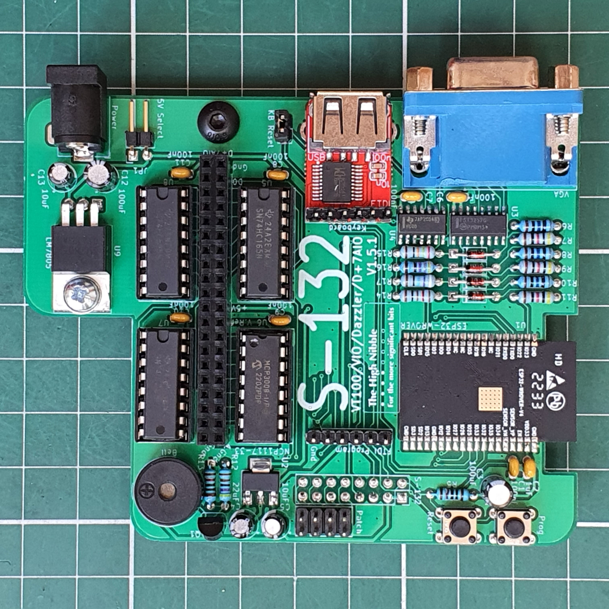

# Build notes

## Hi-resolution image of the finished PCB

The following image has a resolution of 3024x3024.
Right click on the image and open in a new window/tab to see at a higher resolution.

## Notes

The nearest thing to assembly instructions is the [Bill-of-Materials](../bom/)

The PCB has all the components marked.

As a general guide, proceed in the order of the BOM, with the following notes:
- use **lots of flux** on the SMDs
  - don't even attempt them without flux
  - a flux cored solder is not enough
- the ESP32 module goes with the metal can face down in the cutout in the PCB
  - this holds it in position for soldering
  - see the image above.
- the two SOIC package SMD ICs are the hardest ones to orientate correctly 
  - read their data sheets on how to identify pin 1
  - the location for pin 1 is marked clearly on the PCB silkscreen
- once you've soldered the SMDs, most people use a rule of thumb:
  - to solder the through-hole components starting with the lowest/shortest/closest to the board 
  - then moving up through to the tallest components last
- use a multimeter to measure the resistance and correctly identify the resistors
- use masking/painters tape to hold things in place if you need an extra pair of hands
- don't solder the DIP-16 ICs directly to the PCB, use the sockets
