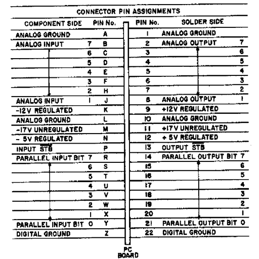

# D+7A I/O connector pinouts

## Original S-100 Cromemco D+7A I/O connector

The following diagram is from the original Cromemco D+7A I/O documentation

## S-132 D+7A I/O connector

The S-132 D+7A I/O 40-pin (female) connector closely matches the original Cromemco D+7A I/O 44 position edge connector providing most of the same Analog and Digital inputs and outputs in the same configuration.
Mainly it differs in the voltages that are (or are not) provided around the middle of the connector.

| ESP32 Side     |   | Pin No. | Pin No. | LM7805 Side |   |
|---------------:|---|:-------:|:-------:|-------------|---|
|                |   | Top | Top |            |   |
| Analog Ground (1) |   | A | 1  | Ground        |   |
| Analog Input (2)  | 7 | B | 2  | N/C           | 7 |
|                | 6 | C | 3  | N/C           | 6 |
|                | 5 | D | 4  | N/C           | 5 |
|                | 4 | E | 5  | N/C           | 4 |
|                | 3 | F | 6  | Analog Output (3) | 3 |
|                | 2 | H | 7  | N/C           | 2 |
|                | 1 | J | 8  | Analog Output (3) | 1 |
| Voltage Ref. (4) |   | H | 9  | Voltage Ref. (4) |   |
| +5V DC Regulated  |   | N | 10 | +5V DC Regulated |   |
| Input _STB (5) |   | P | 11 | Output _STB (6) |   |
| Digital Input Bit (7) | 7 | R | 12 | Digital Output Bit (8) | 7 |
|                   | 6 | S | 13 |                    | 6 |
|                   | 5 | T | 14 |                    | 5 |
|                   | 4 | U | 15 |                    | 4 |
|                   | 3 | V | 16 |                    | 3 |
|                   | 2 | W | 17 |                    | 2 |
|                   | 1 | X | 18 |                    | 1 |
|                   | 0 | Y | 19 |                    | 0 |
|           Ground  |   | Z | 20 | Ground             |   |
|                   |   | Bottom  | Bottom |               |   |

## Notes:

1. `Analog Ground` is isolated from `Ground` 
    - for most use cases you should tie it to `Ground`
2. `Analog Input 1 to 7`
    - these are digitized by the **MCP3008 ADC**
    - typically `0V` to `Voltage Ref. V` for signed input port values of `-128 to 127`
    - see the **MCP3008 ADC** data sheet for exact specifications 
3. There are only two (2) analog outputs `Analog Output 1` and `Analog Output 3`
    - because there are only two (2) DACs on the **ESP32**
    - these are `0V` to `+3.3V` (or slightly between these limits) for signed output port values of -128 to 127
    - you can map any of the Analog Output ports to either of these two (2) DACs (see config guide for D+7AIO settings)
    - it's 1 & 3 because that is what the Cromemco JS-1 Analog Joysticks used for audio
4. `Voltage Ref.` is the V.Ref on the MCP3008 ADC
    - for most use cases you should tie it to `+5V Regulated`
5. `Input _STB` (active low) **isn't** implemented - because... reasons.
6. `Output _STB` (active low) **is** implemented
    - as a working example: this is used on the Parallel Printer interface as the parallel output data strobe
7. `Digital Input Bits 0 to 7` 
    - these are buffered by the **74HC165** with a `+5V DC` regulated supply for `Vcc`
    - typically `> 3.15V = 1` and `< 1.35V = 0`
    - see the **74HC165** data sheet for exact specifications
8. `Digital Output Bits 0 to 7`
    - these are driven by the **74HC595** with a `+5V DC` regulated supply for `Vcc`
    - typically `0V = 0` and `+5V (Vcc) = 1`
    - see the **74HC595** data sheet for exact specifications
