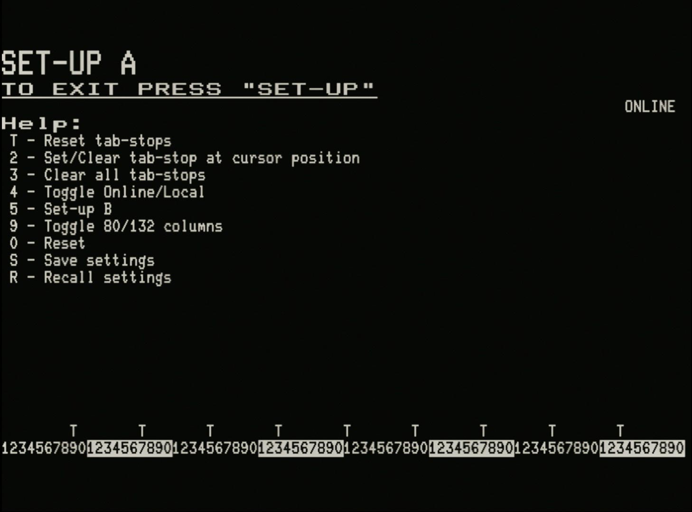
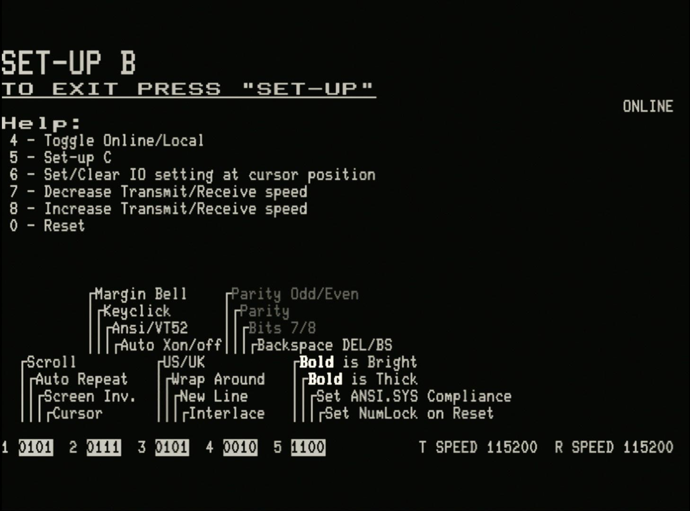

# VT100 (enhanced) Operator Information (Draft)

## Background

The VT132 faithfully implements almost all of the features of the original Digital Equipment Corporation (DEC) VT100, with the Advanced Video Option installed.

To this a range of enhancements have been added

- many are features of later DEC VT family terminals that have been implemented for convenience
- some are features of "standard" ANSI terminals (mainly IBM PC/MS DOS based terminal emulators)
- enhancements are highlighted by the addition of *(enhancement)* to the heading or description

A good reference for an owner of a VT100 (especially getting started with the Setup screens) is the original [VT100 Users Guide](https://vt100.net/docs/vt100-ug/contents.html) over at [VT100.net](https://vt100.net/). Details of what the [Advanced Video Option](https://vt100.net/docs/vt100-ug/chapter4.html#S4.1) adds can be found here also.

The remainder of this section will largely focus on where the VT132 implementation of the VT100 differs to an original VT100.

:::tip
Each heading is a link to the corresponding section of Chapter 1 of the original VT100 Users Guide
:::

## [Part 1 - Keyboard Control and Indictors](https://vt100.net/docs/vt100-ug/chapter1.html#S1.1)

The DEC VT100 keyboard differs from a modern PC (PS/2) keyboard in a numbers of ways. The following keyboard mappings are made for keys that were present on the VT100 but not available or not the same on a PC keyboard.

### Key and indicator mappings for the PC keyboard

The `SETUP` key is mapped to `<Alt><SysReq>` or `<Alt><PrintScreen>`

The `ONLINE` and `LOCAL` indicators are not shown on a PC keyboard but the mode is shown in the SET-UP screens by a visual [ONLINE/LOCAL](#online-local-indicator) indicator.

The `KEYBOARD LOCKED` indicator and the keyboard lock function **are not implemented** by the VT132.

The `L1-L4` indicators **are not implemented** by the VT132.

The `BACKSPACE` key transmits the code for backspace set by the [DECBKM](###) Backarrow Key Mode *(enhancement)*

The `BREAK` key function **is not implemented** by the VT132.

The `PF1-PF4` keys are mapped to `F1-F4`.

The `F5-F12` keys transmit ANSI escape sequences for these additional function keys *(enhancement)*.

The `LINEFEED` key does not exist on a PC keyboard but is equivalent to pressing `<Ctrl><J>`.

The `NO SCROLL` key is mapped to the `<Scroll Lock>` key on a PC keyboard and is equivalent to pressing `<Ctrl><S>` and `<Ctrl><Q>` alternatively.

### International keyboard support *(enhancement)*

The original VT100 keyboard was essentially a US keyboard with a small concession to the UK in that the `<Shift><3>` combination could be configured to transmit a `£` symbol instead of the usual `#`. This is also true of the VT132, see US/UK setting in SET-UP B.

In addition to the standard US PC keyboard layout, the VT132 also supports international keyboards for the UK, Germany and Italy (with more to follow), see [Keyboard in SET-UP D](setup-d/#international-keyboard-support).

## [Part 2 - Set-Up Mode](https://vt100.net/docs/vt100-ug/chapter1.html#S1.2)

`SET-UP A` and `SET-UP B` screens are faithful to the original VT100 with the following exceptions:

### ONLINE/LOCAL indicator

All setup screens display either `ONLINE` or `LOCAL` at the right-hand-end of line 4 to compensate for the absence of indicator LEDs for this purpose on the PC keyboard.

### SET-UP screen HELP *(enhancement)*

All setup screen include integrated help that can be displayed by pressing function key `F1` on each setup screen.

The `SET-UP A` and `SET-UP B` screens with integrated help are shown here:

### SET-UP A - reset Tab-Stops *(enhancement)*

The VT132 implements the key combination `<Shift><T>` to reset tab-stops to the default 8 character spacing. This was a feature on the VT102.

### SET-UP B - T/R Speed

The original VT100 provided support for independent baud rates for Transmit `T SPEED` and Receive `R SPEED` speeds from 50 to 19200 baud.

The VT132 supports baud rates from 300 to 115200 and the Transmit and Receive speed must be the same. The available speeds are `300, 1200, 2400, 4800, 9600, 19200, 38400, 57600, 115200` corresponding to the speeds supported by most RC2014 serial interface cards based on the available clock settings.

Consequently in `SET-UP B`, both the `7` and the `8` key will cycle through the available baud rates changing both `T SPEED` and `R SPEED` simultaneously.

### SET-UP B - clear NVR (reset to factory defaults) *(enhancement)*

**Only** on the `SET-UP B` screen the key combination `<Shift><C>` will clear the NVR for the VT100.
This will cause a return to factory defaults on the next power-up, hardware reset, soft reset `0` or recall `<Shift><R>`.

### SET-UP B - advance to next setup screen *(enhancement)*

On the `SET-UP B` screen, pressing `5` will advance to the `SET-UP C` and then onto the `SET-UP D` screens, before returning to the `SET-UP A` screen.

See the separate sections on the features of the [SET-UP C](setup-c/) and [SET-UP D](setup-d/) screens.

### [SET-UP C - Code Pages, ANSI colours, System Information *(enhancement)*](setup-c/)

### [SET-UP D - Multinational Character Set, NRCS, International Keyboards, Personalities  *(enhancement)*](setup-d/)

## [Part 3 – Definition of Each SET-UP Feature](https://www.vt100.net/docs/vt100-ug/chapter1.html#S1.3)

The definition and function of each feature on the `SET-UP A` and `SET-UP B` screens is faithful to the original VT100, as described in the User Guide, with the following exceptions:

### BITS PER CHARACTER *(enhancement)*

The `bits per character` for the VT132 is fixed at 8, enabling 8-bit extended ASCII modes of operation

- bit 8 **is not set to space (or 0)** for characters transmitted
- bit 8 **is not ignored** for characters received

### INTERLACE

Interlace is simulated by rendering blank scan lines in the doubled scan lines normally rendered in non-interlace mode.

### PARITY

The `parity` for the VT132 is fixed to `None` given that the `bits per character` is fixed at 8.

### PARITY SENSE (ODD/EVEN)

The `parity sense` for the VT132 is not relevant as the `parity` is fixed to `None`.

### POWER *(enhancement)*

The `power` line frequency of the original VT100 (50Hz or 60Hz) is not relevant to the VT132.

This 'soft switch' bit on the `SET-UP B` screen has been replaced with a bit that shows/sets the current [DECBKM](###) Backarrow Key Mode *(enhancement)*.

### SCREEN BRIGHTNESS

The VT132 **does not implement** the `screen brightness` feature of the original VT100.

## [Part 4 – Self-Testing the VT100](https://www.vt100.net/docs/vt100-ug/chapter1.html#S1.4)

The self testing described in this section of the VT100 User Guide **is not implemented** by the VT132.

There are tests performed during power-up for the internal memory of the ESP32, keyboard and Nonvolatile Memory (NVR). But error codes resulting from these tests are not displayed on the VT100.
